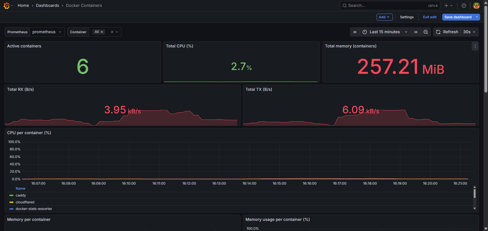

# Docker Stats Exporter

A lightweight Node.js service that exposes Docker container metrics in Prometheus format.  
It collects CPU, memory, network, block I/O and PIDs usage from running containers using the Docker API.

You can use this exporter together with Prometheus and Grafana to build dashboards.  
This repository also includes a **ready-to-import Grafana dashboard**.

---

## 📦 Features

- Exposes metrics at `/metrics` in Prometheus format
- Collects (per container):
  - CPU usage (total seconds)
  - Memory usage & memory limit
  - Network I/O (rx/tx bytes)
  - Block I/O (read/write bytes)
  - PIDs count
- Works on **Linux** and **Windows (Docker Desktop)**
- Includes:
  - `grafana-dashboard.json` – example Grafana dashboard
  - `grafana-dashboard.png` – screenshot of the dashboard

---

## 📁 Requirements

- Node.js 16 or newer (if running directly)
- Docker installed and running (if using the container)
- Access to Docker Engine socket:
  - **Linux:** `/var/run/docker.sock`
  - **Windows:** `//./pipe/docker_engine` (when running directly on Windows, not inside a container)

---

## 🚀 Running the exporter (Node.js)

### 1. Install dependencies

```sh
npm install
````

### 2. Start the server

```sh
node index.js
```

### 3. Access the metrics

Open in your browser or curl:

```text
http://localhost:9417/metrics
```

You should see Prometheus-formatted metrics like:

```text
docker_container_cpu_usage_seconds_total{container_name="nginx"} 12.34
docker_container_memory_usage_bytes{container_name="nginx"} 12345678
docker_container_network_receive_bytes_total{container_name="nginx"} 98765
```

---

## 🐳 Running with Docker

This repository includes a `Dockerfile` and a `docker-compose.yml` to run the exporter as a container.

### 1. Build the Docker image

From the repository root:

```sh
docker build -t docker-stats-exporter:local .
```

This will build a lightweight image based on `node:20-alpine` using the provided `Dockerfile`.

### 2. Run with Docker Compose

Start the service:

```sh
docker compose up -d
```

This will:

* Run the exporter as `docker-stats-exporter`
* Expose port **9417** on the host
* Mount `/var/run/docker.sock` read-only so the exporter can read stats for all containers

Then access:

```text
http://localhost:9417/metrics
```

> 💡 If Prometheus is running in Docker on the same network, you can use
> `docker-stats-exporter:9417` as the target in Prometheus.

---

## ⚙️ Configuration

### Port

Default port is **9417**. You can change it by setting:

```sh
PORT=8080 node index.js
```

or in Docker Compose:

```yaml
services:
  docker-stats-exporter:
    environment:
      - PORT=8080
    ports:
      - "8080:8080"
```

### Prometheus scrape config

Add this to your Prometheus configuration:

```yaml
scrape_configs:
  - job_name: "docker-stats-exporter"
    static_configs:
      - targets: ["localhost:9417"]
```

If Prometheus is running in Docker and this exporter is in the same Docker network, adjust the target accordingly, for example:

```yaml
      - targets: ["docker-stats-exporter:9417"]
```

---

## 📊 Grafana dashboard

This repository includes a ready-to-use Grafana dashboard:

* **JSON file:** `grafana-dashboard.json`



The dashboard includes:

* Summary stats:

  * Active containers
  * Total CPU usage (% across containers)
  * Total memory usage
  * Total network RX/TX (B/s)
* Per-container charts:

  * CPU usage (%)
  * Memory usage (bytes and %)
  * Network RX/TX (B/s)
  * Disk read/write (B/s)
* A **“Container summary”** table with:

  * CPU (%)
  * Memory (bytes and %)
  * Network RX/TX (B/s)
  * PIDs

### Importing the dashboard

1. Open Grafana.
2. Go to **Dashboards → New → Import**.
3. In **“Import via dashboard JSON”**:

   * Either upload `grafana-dashboard.json`
   * Or open the file and paste its contents into the text area.
4. Click **Load**.
5. Select your **Prometheus** data source when prompted.
6. Click **Import**.

The dashboard expects the metrics exported by this service:

* `docker_container_cpu_usage_seconds_total`
* `docker_container_memory_usage_bytes`
* `docker_container_memory_limit_bytes`
* `docker_container_network_receive_bytes_total`
* `docker_container_network_transmit_bytes_total`
* `docker_container_block_read_bytes_total`
* `docker_container_block_write_bytes_total`
* `docker_container_pids`

If you already have Prometheus scraping this exporter, the dashboard should start populating immediately.

---

## 🧠 How CPU and memory are calculated

The exporter uses the Docker API (similar to `docker stats`) to compute:

* **CPU**: exposes `docker_container_cpu_usage_seconds_total` (total CPU time in seconds).
  In Grafana, CPU% is derived using PromQL over the rate of this metric.
* **Memory**:

  * `docker_container_memory_usage_bytes`
  * `docker_container_memory_limit_bytes`

  Memory% is derived in Grafana as:

  ```text
  100 * usage / limit
  ```

This keeps the exporter simple and lets Prometheus/Grafana handle rates and percentages.

---

## 📝 License

MIT License — feel free to use, modify, and contribute.
